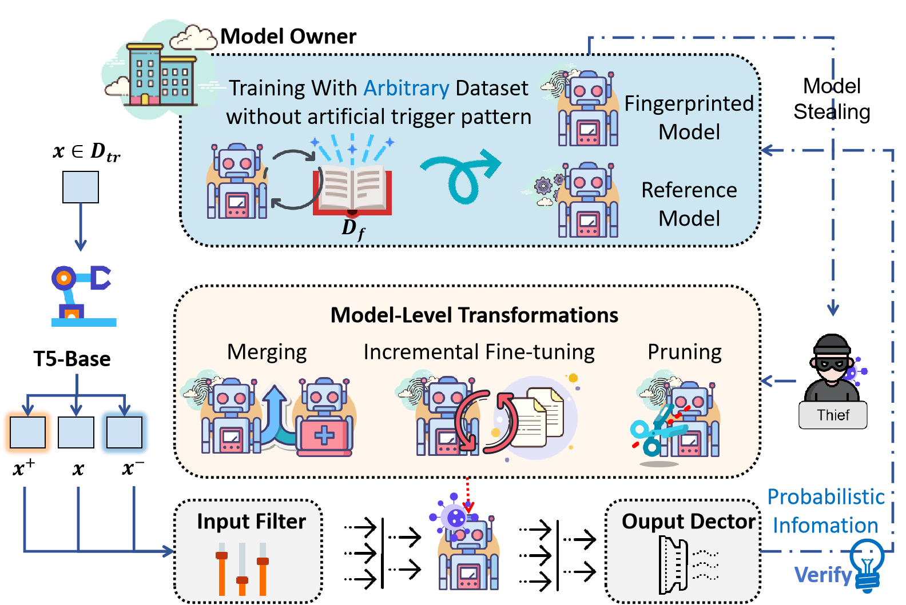
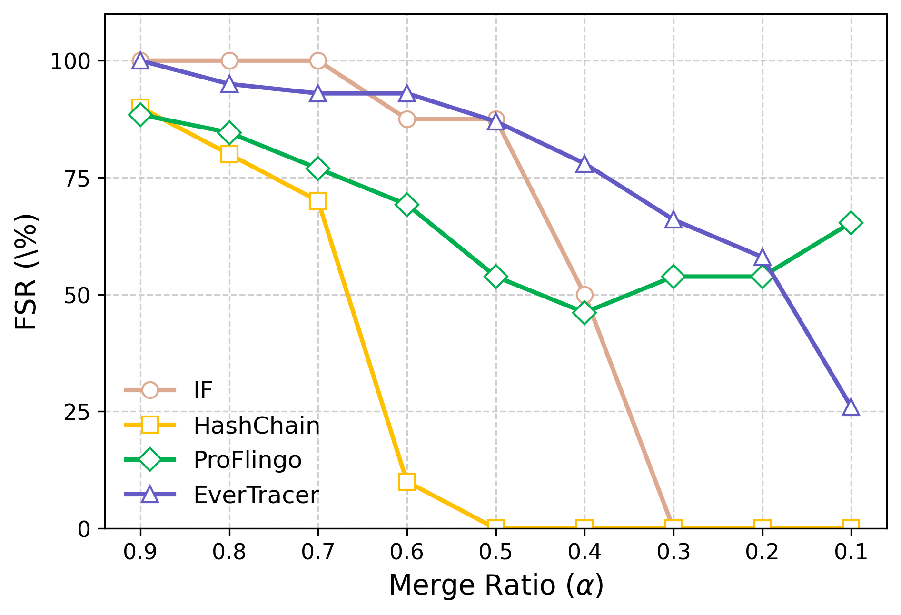
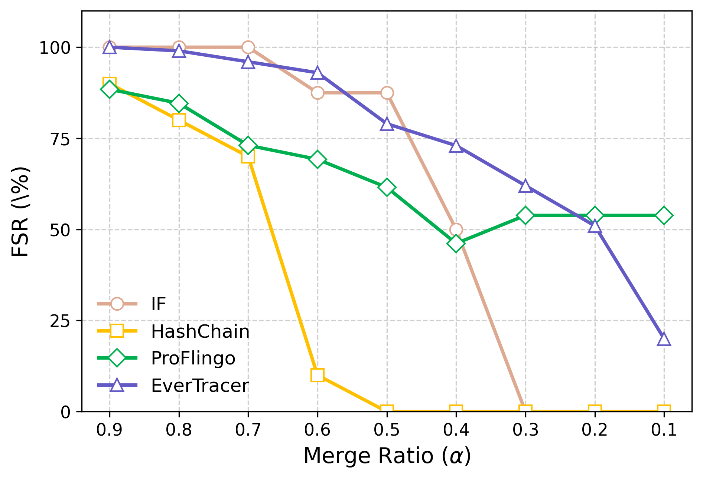
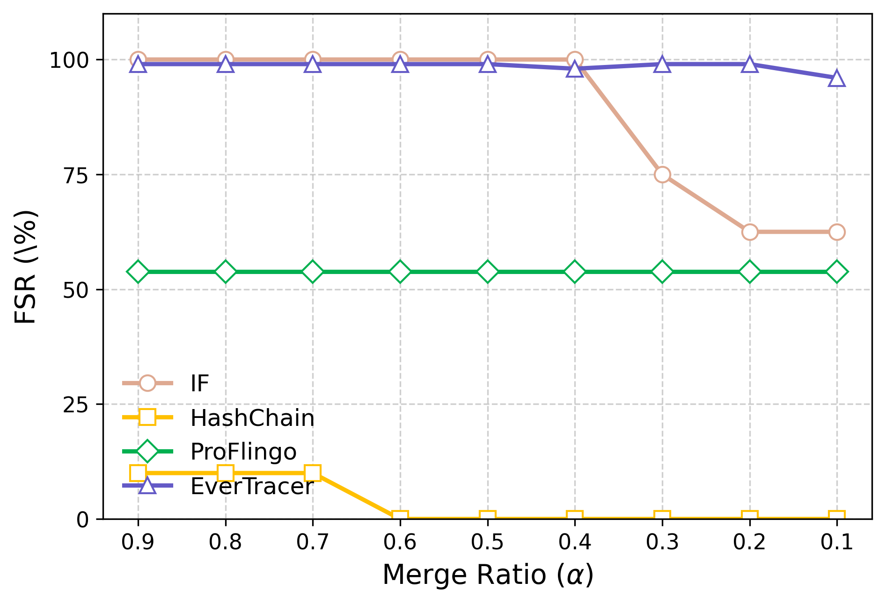
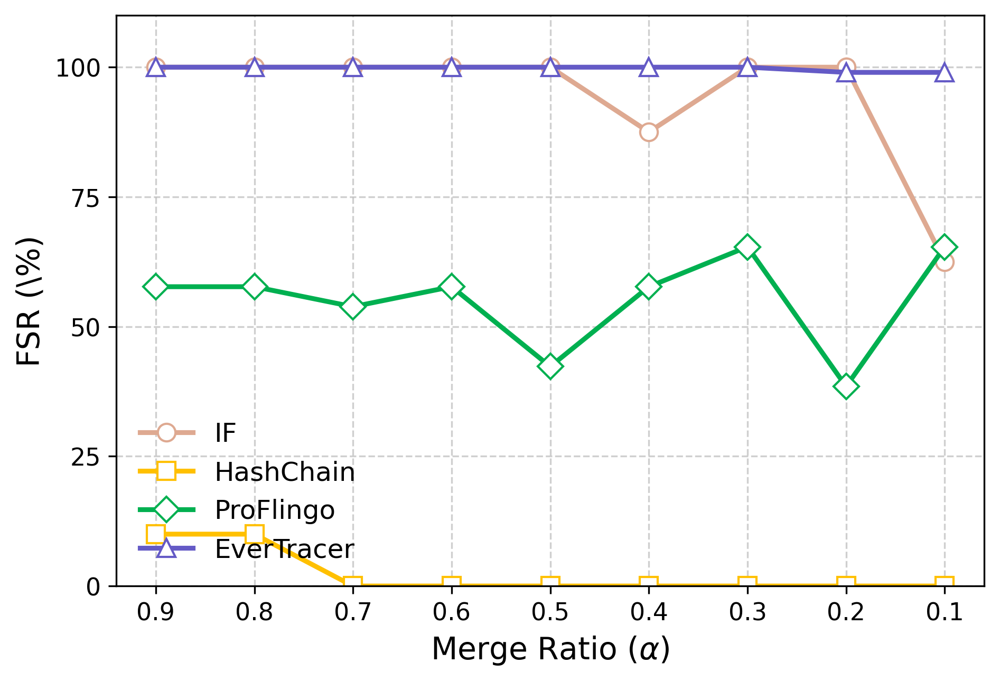
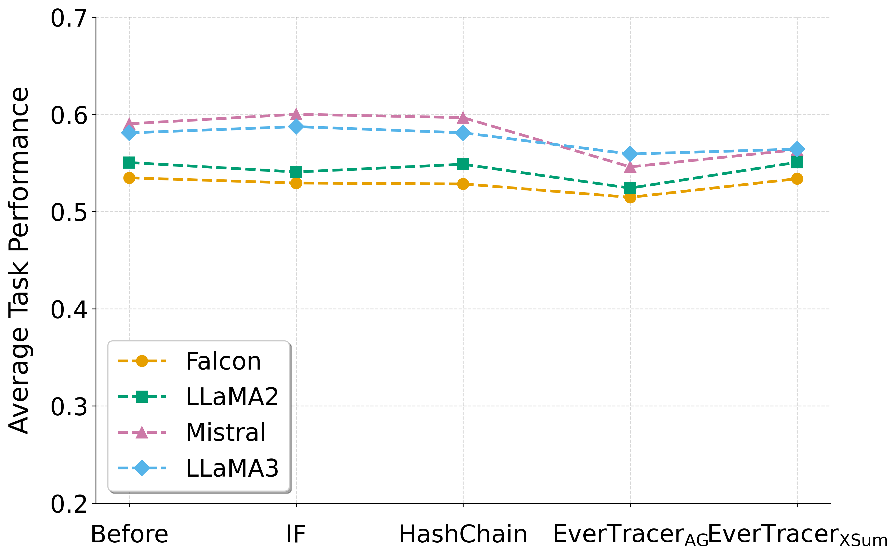

# EverTracer

## 1. Environment Setup

To ensure reproducibility, we provide YAML files for all environments used in this paper:

- `Fingerprinting/evertracer.yaml`
- `Experiments/model-pruning/model-pruning.yaml`
- `Experiments/model-merging/model-merging.yaml`

Please set up the three environments separately using the following commands:

```bash
cd EverTracer
# For general experiments
conda env create -f Fingerprinting/evertracer.yaml
conda activate evertracer

# For model pruning experiments (including pruning and post-pruning inference)
conda env create -f Experiments/model-pruning/model-pruning.yaml
conda activate model-pruning

# For model merging experiments
conda env create -f Experiments/model-merging/model-merging.yaml
conda activate model-merging
```

**Environment Usage Guidelines**:
- The `evertracer` environment is used for all experiments except model pruning and model merging.
- The `model-pruning` environment supports all experiments related to model pruning and evaluation (for baselines).
- The `model-merging` environment is solely used for model merging operations. For inference after merging, please use the `evertracer` environment.

> **Note**: Make sure you install these environments before running the corresponding experiments.

We use LLaMA3 as the default model and XSUM as the default fingerprint dataset for EverTracer-related experiments.

## 2. Core Pipeline: Fingerprint Embedding & Verification

This section introduces the core pipeline of EverTracer — fingerprint injection and probabilistic variation–based fingerprint verification, aligned with the Effectiveness Evaluation in the paper.

<div style="display: flex; justify-content: flex-start; margin: 20px 0;">
    
</div>

The figure above illustrates the complete workflow of EverTracer, including:
1. Fingerprint embedding through LoRA-based fine-tuning
2. Probabilistic variation-based verification
3. Robustness evaluation against various attacks
4. Performance analysis and comparison with baseline methods

### 2.1 Fingerprint Model Training (Victim Model)

This stage injects natural language fingerprints into the target model via LoRA-based fine-tuning.

```bash
cd EverTracer/Fingerprinting

CUDA_VISIBLE_DEVICES=0 accelerate launch --main_process_port 29501 ./ft_llms/llms_finetune.py \
  --output_dir ../TrainedCheckpoint/Llama-3-8B/EverTracer/xsum/target/100 \
  -d EdinburghNLP/xsum -m meta-llama/Llama-3-8B \
  --block_size 128 --eval_steps 100 --save_epochs 25 --log_steps 10 \
  --packing --use_dataset_cache \
  -e 20 -b 4 -lr 1e-4 --gradient_accumulation_steps 1 \
  --train_sta_idx=0 --train_end_idx=100 \
  --eval_sta_idx=0 --eval_end_idx=300 \
  --peft lora --lora_rank 8

cd EverTracer/Utils

python merge_lora.py \
    --base_model_path meta-llama/Llama-3-8B \
    --adapter_path ../TrainedCheckpoint/Llama-3-8B/EverTracer/xsum/target/100/{checkpoint} \
    --output_dir ../TrainedCheckpoint/Llama-3-8B/lora/sft/EverTracer/xsum/target/100/merge_lora
```

### 2.2 Reference Model Training (For Calibration)

This stage trains a model using a disjoint subset of the fingerprint dataset to serve as a reference for calibrated verification.

```bash
cd EverTracer/Fingerprinting

CUDA_VISIBLE_DEVICES=0 accelerate launch --main_process_port 29502 ./ft_llms/llms_finetune.py \
  --output_dir ../TrainedCheckpoint/Llama-3-8B/EverTracer/xsum/target/100 \
  -d EdinburghNLP/xsum -m meta-llama/Llama-3-8B \
  --block_size 128 --eval_steps 1000 --save_epochs 2000 --log_steps 250 \
  --packing --use_dataset_cache \
  -e 10 -b 4 -lr 1e-4 --gradient_accumulation_steps 1 \
  --train_sta_idx=10000 --train_end_idx=11000 \
  --eval_sta_idx=0 --eval_end_idx=100 \
  --peft lora --lora_rank 8

cd EverTracer/Utils

python merge_lora.py \
    --base_model_path meta-llama/Llama-3-8B \
    --adapter_path ../TrainedCheckpoint/Llama-3-8B/EverTracer/xsum/target/100/{checkpoint} \
    --output_dir ../TrainedCheckpoint/Llama-3-8B/lora/sft/EverTracer/xsum/target/100/merge_lora
```

### 2.3 Fingerprint Verification via Probability Variation

This stage evaluates whether a suspect model retains latent memorization of the fingerprinted data under gray-box conditions.

```bash
cd EverTracer/Fingerprinting

CUDA_VISIBLE_DEVICES=0 python attack.py \
  --config ../configs/xsum/llama3_config.yaml
```

## 3. Evaluation Framework

### 3.1 Input Stealthiness Evaluation

To evaluate the stealthiness of input perturbations, we provide example code for assessing both the Dolly and Alpaca datasets using perplexity-based metrics.

```bash
cd Experiments/input-stealthness

CUDA_VISIBLE_DEVICES=0 python ppl_calculate.py \
    --model_path meta-llama/Llama-3-8B-Instruct \
    --dataset_path ../..//Datasets/alpaca_data_52k.json \
    --quantize_bits 16 \
    --device cuda:0 \
    --max_samples 500 \
    --source_format alpaca \
    --target_format alpaca

CUDA_VISIBLE_DEVICES=0 python ppl_calculate.py \
    --model_path meta-llama/Llama-3-8B-Instruct \
    --dataset_path ../../Datasets/dolly_en_15k.json \
    --quantize_bits 16 \
    --device cuda:0 \
    --max_samples 500 \
    --source_format alpaca \
    --target_format alpaca
```

### 3.2 Robustness Evaluation

#### 3.2.1 Input Perturbation Robustness

To systematically evaluate EverTracer's resilience against input perturbations, we conduct experiments by modifying key configuration parameters that control the perturbation process. The evaluation framework allows us to assess how well the fingerprinting mechanism maintains its effectiveness under various types of input modifications.

**Key Configuration Parameters**:
- `perturb: true` - Activates the input perturbation mechanism
- `perturb_fuc: "remove"` - Specifies character removal as the perturbation strategy
- `perturb_ratio: 0.05` - Defines the proportion of characters to be perturbed (5%)

```bash
cd EverTracer/Fingerprinting
CUDA_VISIBLE_DEVICES=0 python attack.py \
  --config ../configs/xsum/llama3_config-remove.yaml
```

#### 3.2.2 Model Pruning Robustness

```bash
cd Experiments/model-pruning
```

We utilize an open-source framework for model pruning:
```bash
git clone https://github.com/horseee/LLM-Pruner.git
```

We apply four different pruning strategies supported by the framework:
```bash
bash get_pruned_models.sh
```

This will generate pruned model files in the target model directory. For example, with Taylor pruning:
`prune/taylor-0.10/pytorch_model.bin`

We provide a configuration for fingerprint detection on the pruned model, mainly by modifying the target_model_bin parameter in the config:
```bash
cd EverTracer/Fingerprinting
CUDA_VISIBLE_DEVICES=0 python attack.py \
  --config ../configs/xsum/llama3_config-prune.yaml
```

#### 3.2.3 Model Merging Robustness

For model merging experiments, we employ an open-source framework:

```bash
# Set up the environment
conda activate model-merging
git clone https://github.com/arcee-ai/mergekit.git
cd mergekit
pip install -e .  # Install the package and make scripts available
```

We provide a streamlined script for rapid model merging:
```bash
cd Experiments/model-merging
bash batch-mergekit.py
```

> **Note on Resource Management**: The batch merging process generates multiple merged models, which can significantly impact disk space utilization. For systems with limited storage capacity, we recommend processing one model at a time. This can be controlled by adjusting the `weight_ratios` array size in the Python script.

The merging process will create the following directories under the target model directory:
- `task`
- `dare_task`
- `ties`
- `dare_ties`

### Merging Results Analysis

We evaluate four different merging strategies and their impact on model performance. The following figures illustrate the results:

<div style="display: flex; flex-direction: column; align-items: center; gap: 20px; width: 50%; margin: 0 auto;">
    <div style="display: flex; justify-content: center; gap: 20px; width: 100%;">
        <div style="text-align: center; width: 50%;">
            <h4>Task-based Merging</h4>
            
        </div>
        <div style="text-align: center; width: 50%;">
            <h4>Task-based Merging with DARE</h4>
            
        </div>
    </div>
    <div style="display: flex; justify-content: center; gap: 20px; width: 100%;">
        <div style="text-align: center; width: 50%;">
            <h4>TIES Merging</h4>
            
        </div>
        <div style="text-align: center; width: 50%;">
            <h4>TIES Merging with DARE</h4>
            
        </div>
    </div>
</div>

The results demonstrate the effectiveness of different merging strategies in maintaining model performance while preserving fingerprint information. Each approach shows distinct characteristics in terms of:
- Model performance preservation
- Fingerprint retention
- Computational efficiency
- Memory utilization

To proceed with the evaluation:
1. Select an appropriate merged model
2. Update the `target_model` parameter in `EverTracer/Fingerprinting/configs/xsum/llama3_config.yaml`
3. Execute the attack evaluation:

```bash
cd EverTracer/Fingerprinting

CUDA_VISIBLE_DEVICES=0 python attack.py \
  --config ../configs/xsum/llama3_config.yaml
```

#### 3.2.4 Incremental Training Robustness

For incremental training evaluation, we utilize the LLaMA-Factory framework. The evaluation process consists of the following steps:

1. **Framework Setup**:
```bash
git clone https://github.com/hiyouga/LLaMA-Factory.git
```

2. **Dataset Registration**:
Follow the framework's documentation to register your incremental training dataset. In our experiments, we utilize the Dolly dataset (located at Datasets/dolly_en_15k.json) as a demonstration example.

3. **Model Training**:
Navigate to the LLaMA-Factory directory and execute the training command:
```bash
cd LLaMA-Factory

CUDA_VISIBLE_DEVICES=2 llamafactory-cli train \
    --model_name_or_path ../TrainedCheckpoint/Llama-3-8B/EverTracer/xsum/target/100/merge_lora \
    --output_dir ../TrainedCheckpoint/Llama-3-8B/EverTracer/xsum/target/100/merge_lora/dolly_en_15k \
    --template llama3 \
    --dataset dolly_en_15k \
    --save_steps 10000 \
    --num_train_epochs 2 \
    --stage sft \
    --do_train \
    --dataset_dir ./data \
    --finetuning_type lora \
    --lora_target all \
    --overwrite_cache \
    --overwrite_output_dir \
    --cutoff_len 1024 \
    --preprocessing_num_workers 16 \
    --per_device_train_batch_size 2 \
    --per_device_eval_batch_size 2 \
    --gradient_accumulation_steps 8 \
    --lr_scheduler_type cosine \
    --logging_steps 100 \
    --warmup_steps 20 \
    --evaluation_strategy "no" \
    --learning_rate 5e-5 \
    --max_samples 100000 \
    --plot_loss \
    --fp16
```

4. **Model Evaluation**:
After training completion:
   1. Merge the trained LoRA adapter following the previous instructions
   2. Update the `target_model` parameter in `EverTracer/Fingerprinting/configs/xsum/llama3_config.yaml`
   3. Execute the attack evaluation using the standard evaluation command

### 3.3 Harmlessness Evaluation

For harmlessness evaluation, we employ the open-source framework `lm-evaluation-harness`. The evaluation process consists of the following steps:

1. **Framework Installation**:
```bash
git clone --depth 1 https://github.com/EleutherAI/lm-evaluation-harness
cd lm-evaluation-harness
pip install -e .
```

2. **Evaluation Execution**:
```bash
cd Experiments/harmlessness
bash eval_harmlessness.sh
```

The evaluation script will generate a log file in the current directory, containing detailed metrics and evaluation results for each harmlessness criterion.

3. **Results Analysis**:
<div style="display: flex; justify-content: flex-start; margin: 20px 0;">
    
</div>

The results demonstrate that our approach maintains comparable performance with baseline methods while ensuring model safety and reliability. The evaluation metrics include:
- Toxicity scores
- Bias measurements
- Safety compliance rates
- Ethical alignment scores

### Ablation Experiment on Reference Model

In alignment with the experimental scenarios described in the paper, we conduct ablation experiments on incrementally trained models without utilizing reference models for FSR and AUC calculations. Below is the command to execute the ablation experiment:

```bash
CUDA_VISIBLE_DEVICES=0 python attack.py --config /work/xzh/SPV-MIA/configs/xsum/reliable/llama3_config.yaml
```

# Baseline Methods

To facilitate a comprehensive comparison between our experimental results and the original IF method's performance in incremental training scenarios, we provide detailed training configurations. We utilize the LLaMA-Factory framework for both training and inference, enabling efficient verification of experimental results.

## IF-SFT Baseline Implementation

1. **Initial Training**:
```bash
cd LLaMA-Factory
CUDA_VISIBLE_DEVICES=0 llamafactory-cli train ../Baselines/IF-SFT/llama3_lora_sft_if.yaml
```

2. **Inference**:
After training, use the following command to generate predictions (results will be saved in the predict directory):
```bash
CUDA_VISIBLE_DEVICES=0 llamafactory-cli train \
    --stage sft \
    --do_predict \
    --model_name_or_path meta-llama/Llama-3-8B \
    --adapter_name_or_path ../TrainedCheckpoint/Llama-3-8B/lora/sft/if_chat_fp \
    --eval_dataset if_chat_fp \
    --dataset_dir ./data \
    --template llama3 \
    --finetuning_type lora \
    --output_dir ../TrainedCheckpoint/Llama-3-8B/lora/sft/if_chat_fp/predict \
    --overwrite_cache \
    --overwrite_output_dir \
    --cutoff_len 1024 \
    --preprocessing_num_workers 16 \
    --per_device_eval_batch_size 1 \
    --max_samples 8 \
    --predict_with_generate
```

3. **Incremental Training**:
After merging the LoRA adapter, execute the following command:
```bash
CUDA_VISIBLE_DEVICES=2 llamafactory-cli train \
    --model_name_or_path ../TrainedCheckpoint/Llama-3-8B/lora/sft/if_chat_fp/merge_lora \
    --output_dir ../TrainedCheckpoint/Llama-3-8B/lora/sft/if_chat_fp/merge_lora/dolly_en_15k \
    --template llama3 \
    --dataset dolly_en_15k \
    --save_steps 10000 \
    --num_train_epochs 2 \
    --stage sft \
    --do_train \
    --dataset_dir ./data \
    --finetuning_type lora \
    --lora_target all \
    --overwrite_cache \
    --overwrite_output_dir \
    --cutoff_len 1024 \
    --preprocessing_num_workers 16 \
    --per_device_train_batch_size 2 \
    --per_device_eval_batch_size 2 \
    --gradient_accumulation_steps 8 \
    --lr_scheduler_type cosine \
    --logging_steps 100 \
    --warmup_steps 20 \
    --evaluation_strategy "no" \
    --learning_rate 5e-5 \
    --max_samples 100000 \
    --plot_loss \
    --fp16
```

**Note**: After incremental training, the FSR drops to 0%.

## Additional Baseline Methods

For other experiments, the workflow is similar to EverTracer. After merging, you can use the LLaMA-Factory framework for inference. However, for model pruning and input perturbation experiments, the framework does not support loading pruned model binaries or applying perturbations. Therefore, we provide separate `evaluation.py` scripts in the `Utils` directory for IF-SFT and HashChain baselines.

**Important Note**: For ProFlingo, we do not provide additional implementation as it is already available in an open-source repository: [ProFlingo GitHub Repository](https://github.com/hengvt/ProFLingo).